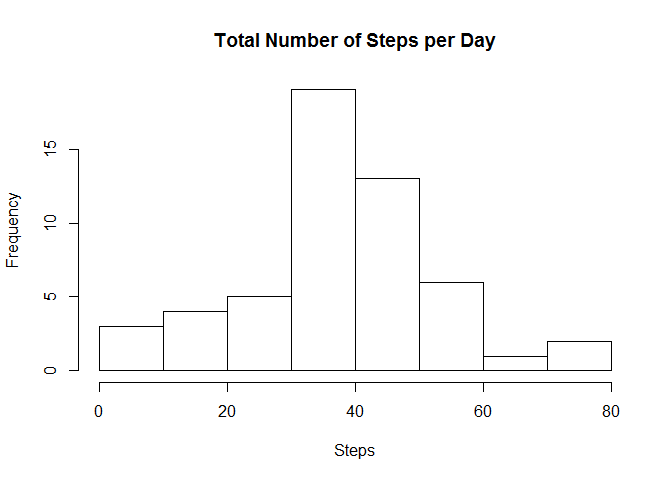
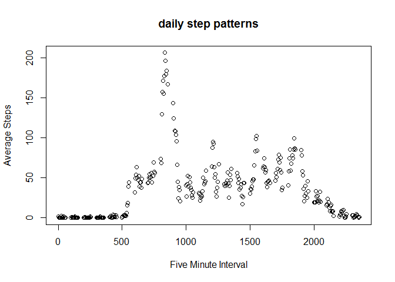
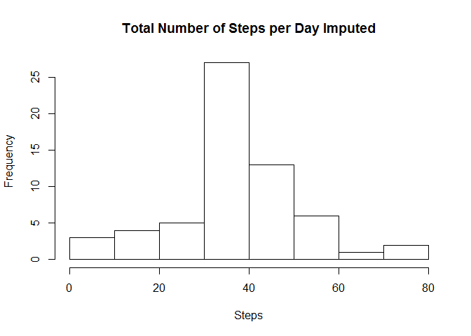
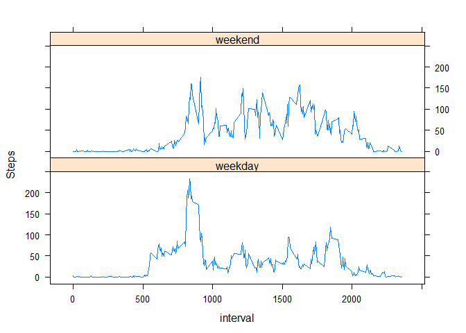

Loading and preprocessing the data
----------------------------------

    library(data.table)

    ## Warning: package 'data.table' was built under R version 3.3.3

    library(lattice)

    Data = as.data.table(read.csv('activity.csv'))

    Data = Data[,date:=as.POSIXct(as.character(date))]

What is mean total number of steps taken per day?
-------------------------------------------------

    Total_steps = Data[,mean(steps,na.rm = T),by = date]
    # 
    # make a histogram# 
    hist(Total_steps$V1,main = 'Total Number of Steps per Day',xlab = 'Steps')

    print(paste0('Daily mean: ',mean(Total_steps$V1,na.rm=TRUE)))

    ## [1] "Daily mean: 37.3825995807128"

    print(paste0('Daily median: ',median(Total_steps$V1,na.rm=TRUE)))

    ## [1] "Daily median: 37.3784722222222"

What is the average daily activity pattern?
-------------------------------------------

    Total_steps = Data[,mean(steps,na.rm = T),by = interval]
    # 
    # make a histogram# 
    plot(Total_steps$interval,Total_steps$V1,main = 'daily step patterns',xlab = 'Five Minute Interval',ylab = 'Average Steps')

    print(paste0('Interval with the most steps: ',Total_steps$interval[which.max(Total_steps$V1)]))

    ## [1] "Interval with the most steps: 835"

Imputing missing values
-----------------------

    # Total number of missing values
    print(paste0('Number of missing data: ',sum(!complete.cases(Data))))

    ## [1] "Number of missing data: 2304"

    Data_equal = copy(Data)

    # Fill in missing values#
    Data_equal$steps[which(is.na(Data_equal$steps))] <- mean(Data_equal$steps,na.rm=T)

    Total_steps = Data_equal[,mean(steps,na.rm = T),by = date]

    hist(Total_steps$V1,main = 'Total Number of Steps per Day Imputed',xlab = 'Steps')

    # 
    print(paste0('Daily mean: ',mean(Total_steps$V1,na.rm=TRUE)))

    ## [1] "Daily mean: 37.3825995807128"

    print(paste0('Daily median: ',median(Total_steps$V1,na.rm=TRUE)))

    ## [1] "Daily median: 37.3825995807128"

The effect of imputing missing data is that the variance of the
distribution is decreased. The mean has not changed but the median has
become closer to the mean.

Are there differences in activity patterns between weekdays and weekends?
-------------------------------------------------------------------------

    # Weekends_factor
    Data = Data[,weekends:='weekday']
    Data = Data[which(weekdays(date)%in%c('Sunday','Saturday')),weekends:='weekend']
    Data = Data[,weekends:=as.factor(weekends)]

    Total_steps = Data[,mean(steps,na.rm = T),by = list(interval,weekends)]

    xyplot(V1 ~ interval | factor(weekends), data=Total_steps,ylab = 'Steps',type = 'l',layout = c(1,2))

